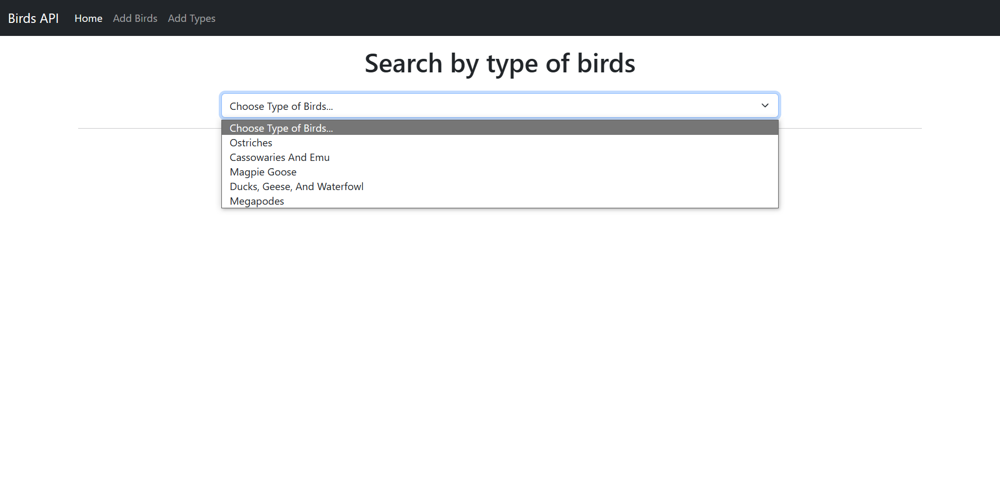

# List Birds API

<div align=center>
  
</div>

<p align=center>List Birds Using RESTful API</p>

This project is a simple API built in local environment using XAMPP. This API allows you to manage data such as getting bird information, adding new data, changing data, and deleting data.

## Usage

### Installation

1. Make sure you have a code editor such as [Visual Studio Code](https://code.visualstudio.com/) installed on your computer.
2. Make sure you have installed [XAMPP](https://www.apachefriends.org/download.html) on your computer.
3. You can use `XAMPP` to run the project. But I suggest you to use `Live Server` extension in Visual Studio Code.
4. Clone this repository into the `htdocs` directory in the `XAMPP` installation folder (make sure the folder name is `list-birds-API` eg: `C:\xampp\htdocs\list-birds-API`).
5. Create a new database in phpMyAdmin with the database name `birds-api`
6. Import the table schema from the `birds-api.sql` file to the database that has been created.
7. Configure the database connection in the `config.php` file with your MySQL settings details.

### Running an API

1. Run XAMPP Control Panel and enable `Apache` and `MySQL`
2. Start the Live Server by typing `Go Live` in the status bar or right-clicking on the HTML File `index.html` and click `Open with Live Server` in the Explorer Window.
2. Open a browser and access `http://127.0.0.1:5500` to view the application.

## Endpoint

Here are some of the endpoints you can access:

- **GET** `/Birds.php` : Get a list of bird information.
- **GET** `/DBHelper.php?typebird_id=1` : Get detailed bird information based on ID Type Bird.
- **GET** `/Type.php` : Get some data in the Type of Bird table.
- **GET** `/Categories.php` : Get some data in the Categories table.
- **POST** `/AddInfo.php?name_of_bird=Struthio&type_of_bird=1&categories_bird=1&file_path=../uploads/struthio.jpg` : Added new bird information.
- **POST** `/AddType.php?type_of_birds=NewType` : Adds a new data Type.
- **POST** `/EditBirds.php?id=1&name_of_bird=Struthio&type_of_bird=1&categories_bird=1&file_path=../uploads/struthio.jpg` : Edits bird data.
- **PUT** `/EditType.php?id=1&type_of_birds=EditedType` : Changes the Type of Bird data.
- **DELETE** `/DelBirds.php?id=1` : Deletes bird information by ID.
- **DELETE** `/DelType.php?id=1` : Deletes Type of Bird data based on ID.

## Usage Examples

### Get a List of Birds
```
GET http://localhost/list-birds-API/controller/Birds.php
```
### Getting Detailed Bird Information
```
GET http://localhost/list-birds-API/controller/DBHelper.php?typebird_id=1
```
### Get Data Type of Bird
```
GET http://localhost/list-birds-API/controller/Type.php
```
### Get Data Categories
```
GET http://localhost/list-birds-API/controller/Categories.php
```
### Added Bird Information
```
POST http://localhost/list-birds-API/controller/AddInfo.php?name_of_bird=Struthio&type_of_bird=1&categories_bird=1&file_path=../uploads/struthio.jpg
```
### Added Data Type of Bird
```
POST http://localhost/list-birds-API/controller/AddType.php?type_of_birds=NewType
```
### Changing Bird Data
```
POST http://localhost/list-birds-API/controller/EditBirds.php?id=1&name_of_bird=Struthio&type_of_bird=1&categories_bird=1&file_path=../uploads/struthio.jpg
```
### Changing Data Type of Bird
```
PUT http://localhost/list-birds-API/controller/EditType.php?id=1&type_of_birds=EditedType
```
### Delete Bird Information
```
DELETE http://localhost/list-birds-API/controller/DelBirds.php?id=1
```
### Delete Data Type of Bird
```
DELETE http://localhost/list-birds-API/controller/DelType.php?id=1
```

## Project Results




---

### Made with ❤️ by

[](https://github.com/AlifMP)